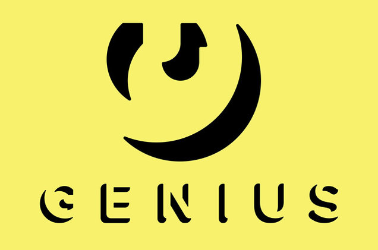

# MSDS498-Capstone
This repository contains the code used for MSDS 498 Capstone Project.

## Introduction

Streaming has become the primary listening format for music in the last decade. It hasgrown at an average rate of 43.9% since 2014 with an annual revenue of $13.7B in theUnited States alone in 2022 [[1]](#1). With any highly profitable business, there are bound tobe many competitors vying for their own share. Spotify currently dominates theglobal music streaming market share at 32% in 2021, but that is on the decline as theywere at 34% in 2019 [[2]](#2). The market is oversaturated-- Amazon Music and YouTubeMusic increased their subscriber count by 25% and 50% respectively in 2021.

**You may ask, "why would we join an oversaturated market?"**

The answer is simple. Our AI generated playlists brings a personalized touch that setsus apart from the rest of the market. Music is very personal. No two people will haveexactly the same tastes, so their playlists should be unique to them.

Aside from personalized playlists, users can ask our chatbot to make them playlistsbased on prompts such as "songs about Tennessee" or "Taylor Swift's saddest songs"
Consumers only need one subscription; we'll make sure Listr is the one they choose.

## About the Data

|
Data Set
|Description|
|:-------------------------------------:|:----------|
| | [The Spotify Web API](https://developer.spotify.com/documentation/web-api) [[3]](#3) empowers the development of applications that seamlessly interact with Spotify's streaming service. It enables retrieving content metadata, accessing recommendations, managing playlists, and controlling playback functionalities. |
|  | [The Lyric Genius API](https://docs.genius.com/) [[4]](#4), which is associated with the Genius platform, provides developers with programmatic access to song lyrics, annotations, and related metadata. This includes features like retrieving lyrics, displaying annotations, searching for songs, and integrating these elements into applications or services. |
|  | Hugging Face is a key player in NLP, known for its versatile "transformers" toolkit. For our project, the team utilized [mrm8488/t5-base-finetuned-emotion](https://huggingface.co/mrm8488/t5-base-finetuned-emotion) [[5]](#5), Google's T5 base model, which was fine-tuned using an emotion recognition dataset. This fine-tuned model was employed for an Emotion Recognition downstream task, showcasing Hugging Face's tools for efficient model deployment and transfer learning in NLP applications.

## Requirements
- Access to [Spotify's API](https://developer.spotify.com/documentation/web-api)
    - You will need to follow [these instructions](https://docs.google.com/document/d/1jyA7lVMDGPY58dkp6uqyZzQIvDeGvZ6be5VlswqpvPg/edit) to get your Client ID and Client Secret API Keys
- Access to [Hugging Face API](https://huggingface.co/)
    - Create a Hugging Face free account and visit access token to generate your personal token.
    - Model we used: [mrm8488/t5-base-finetuned-emotion](https://huggingface.co/mrm8488/t5-base-finetuned-emotion).
- Access to [LyricsGenius API](https://lyricsgenius.readthedocs.io/en/master/index.html)
    - Sign up for a (free) account that authorizes access to [the Genius API](https://genius.com/signup_or_login).
    - Go to the API section on Genius and [create a new API client](https://genius.com/api-clients/new).
    - After creating your client, you can generate an access token to use with the library.
    
Create a config.py to contain all of your API Keys, it should include:
- SPOTIFY_CLIENT_KEY = "YOUR_SPOTIFY_CLIENT_KEY"
- SPOTIFY_SECRET_KEY = "YOUR_SPOTIFY_SECRET_KEY"
- LG_TOKEN = "YOUR_LYRICSGENIUS_USER_TOKEN"

Save config.py file in app directory

## Project Details
All details for this project can be found in the project_reports repository.

01. Listr Project Goals
    - This document outlines our project's objectives, methodology, and expected deliverables to provide a clear understanding of our approach and its potential impact on the organization. We aim to achieve specific goals by conducting a comprehensive analysis using data-driven techniques and advanced analytic tools.

02. Lister Initial Findings
    - This document provides an update on the progress of our consulting project, detailing our initial findings, accomplishments, and addressing concerns regarding expenditure. We are committed to delivering meaningful results aligned with the organization's goals and ensuring efficient resource utilization.

03. Final Report (Coming Soon)
    - This will be the final report that is turned in with problem statement, analysis, graphs, recommendations, and everything else.

## Project Limitations

## Future Enhancements

## References
<a id="1">[1]</a>
David Curry, “Music Streaming App Revenue and Usage Statistics (2023),” Business of Apps, May 2, 2023, https://www.businessofapps.com/data/music-streaming-market/.

<a id="2">[2]</a>
“Music Streaming Market Share and Revenue Statistics: Details on the Biggest Music Streaming Services,” SiriusXM Music forBusiness, January 27, 2023, https://sxmbusiness.com/music-streaming-market-share-and-revenue-statistic.

<a id="3">[3]</a>
“Spotify API,” Web API | Spotify for Developers, accessed July 8, 2023, https://developer.spotify.com/documentation/web-api.

<a id="4">[4]</a>
“Genius API Documentation.” Genius API. Accessed August 6, 2023. https://docs.genius.com/.

<a id="5">[5]</a>
Romero, Manuel. “MRM8488/T5-Base-Finetuned-Emotion · Hugging Face.” mrm8488/t5-base-finetuned-emotion. Accessed August 6, 2023. https://huggingface.co/mrm8488/t5-base-finetuned-emotion. 

## Project Owners
- [Grace Chen](https://github.com/grchen99)
- Patrick
- [Nicholas Drake](https://github.com/DrakeData)
- [Olushola Durojaiye](https://github.com/oluduroj)
- [Lena Lu](https://github.com/lenaxlu)

Repository created: 7/11/2023
